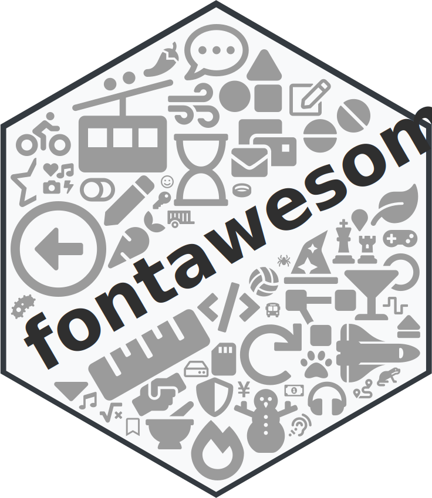
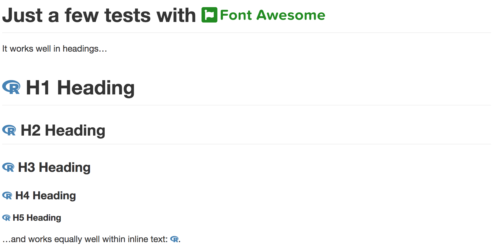
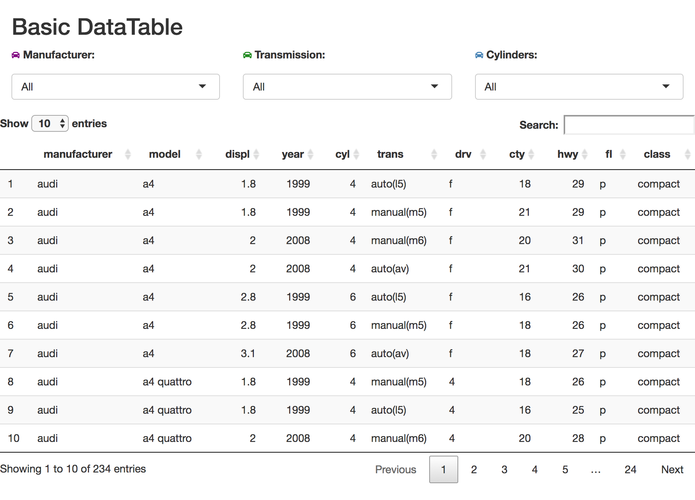

<div align="center">

<a href='https://rstudio.github.io/fontawesome/'></a>

<br />
<!-- badges: start -->

[](https://CRAN.R-project.org/package=fontawesome)
[](https://github.com/rstudio/fontawesome/actions)
[](https://github.com/rstudio/fontawesome/actions)
[](https://app.codecov.io/gh/rstudio/fontawesome?branch=main)

[](https://www.contributor-covenant.org/version/2/0/code_of_conduct/)

<!-- badges: end -->
<br />
</div>


The **fontawesome** R package makes it very easy to insert **Font Awesome** icons into **R Markdown** documents and **Shiny** apps (or, anywhere else you need to put them).

## Examples

The `fa()` function can be used to insert an FA icon. For example, we
can get the *r-project* icon in `steelblue`:

``` r
fa(name = "r-project", fill = "steelblue")
#> <svg xmlns="http://www.w3.org/2000/svg" viewBox="0 0 581 512" class="rfa" style="height:0.75em;fill:steelblue;position:relative;"><path d="M581 226.6C581 119.1 450.9 32 290.5 32S0 119.1 0 226.6C0 322.4 103.3 402 239.4 418.1V480h99.1v-61.5c24.3-2.7 47.6-7.4 69.4-13.9L448 480h112l-67.4-113.7c54.5-35.4 88.4-84.9 88.4-139.7zm-466.8 14.5c0-73.5 98.9-133 220.8-133s211.9 40.7 211.9 133c0 50.1-26.5 85-70.3 106.4-2.4-1.6-4.7-2.9-6.4-3.7-10.2-5.2-27.8-10.5-27.8-10.5s86.6-6.4 86.6-92.7-90.6-87.9-90.6-87.9h-199V361c-74.1-21.5-125.2-67.1-125.2-119.9zm225.1 38.3v-55.6c57.8 0 87.8-6.8 87.8 27.3 0 36.5-38.2 28.3-87.8 28.3zm-.9 72.5H365c10.8 0 18.9 11.7 24 19.2-16.1 1.9-33 2.8-50.6 2.9v-22.1z"/></svg>
```

As can be seen, what we really get from the function is an SVG object that represents the icon. This can be directly used within **R Markdown** with:

``` r
{text} `r fa(...)` {text}
```

Font Awesome SVG icons are great to use instead of `<i>` tags + font files for a few reasons:

- There is less overhead in a **Shiny** app or **R Markdown** document since an `<i>` tag requires computation to obtain the icon (`<svg>` tags represent the actual icon)
- Using `<i>` tags has a 'being online' requirement since network activity is necessary for resolving these tags (SVGs in **fontawesome** are stored in the package, so, no Internet connectivity is necessary for that)
- There are styling options available for SVG that aren't there for icon fonts

### R Markdown

Here is an example **R Markdown** document that includes Font Awesome icons:

    ---
    title: "Font Awesome in R Markdown"
    output: html_document
    ---
    
    ```{r load_packages, message=FALSE, warning=FALSE, include=FALSE} 
    library(fontawesome)
    ```
    
    # Just a few tests with `r fa("font-awesome-logo-full", fill = "forestgreen")`
    
    It works well in headings...
    
    # `r fa("r-project", fill = "steelblue")` H1 Heading
    
    ## `r fa("r-project", fill = "steelblue")` H2 Heading
    
    ### `r fa("r-project", fill = "steelblue")` H3 Heading
    
    #### `r fa("r-project", fill = "steelblue")` H4 Heading
    
    ##### `r fa("r-project", fill = "steelblue")` H5 Heading
    
    ...and works equally well within inline text: `r fa("r-project", fill = "steelblue")`.

This will appear, when knit, as:



### Shiny

Here’s a **Shiny** app (from the [Shiny Gallery](https://shiny.rstudio.com/gallery/basic-datatable.html)) that’s been slightly modified to incorporate Font Awesome icons in the text above the three search fields:

``` r
library(shiny)
library(DT)
library(ggplot2)
library(fontawesome)

ui <- fluidPage(

  titlePanel("Basic DataTable"),

  # Create a new Row in the UI for selectInputs
  fluidRow(

    column(
      width = 4,
      selectInput(
        inputId = "man",
        label = tags$p(fa("car", fill = "purple"), "Manufacturer:"),
        choices = c(
          "All",
          unique(as.character(mpg$manufacturer))))
    ),

    column(
      width = 4,
      selectInput(
        inputId = "trans",
        label = tags$p(fa("car", fill = "forestgreen"), "Transmission:"),
        choices = c(
          "All",
          unique(as.character(mpg$trans))))
    ),

    column(
      width = 4,
      selectInput(
        inputId = "cyl",
        label = tags$p(fa("car", fill = "steelblue"), "Cylinders:"),
        choices = c(
          "All",
          unique(as.character(mpg$cyl))))
    )
  ),

  # Create a new row for the table.
  fluidRow(
    dataTableOutput("table")
  )
)

server <- function(input, output) {

  # Filter data based on selections
  output$table <- renderDataTable({

    data <- mpg
    if (input$man != "All") {
      data <- data[data$manufacturer == input$man,]
    }
    if (input$cyl != "All") {
      data <- data[data$cyl == input$cyl,]
    }
    if (input$trans != "All") {
      data <- data[data$trans == input$trans,]
    }
    data
  })
}

shinyApp(ui = ui, server = server)
```

The **Shiny** app will look something like this:



Please note that using `shiny::icon()` in place of `fontawesome::fa()` will still work. Internally, the `icon()` function will call `fontawesome`'s `fa_i()` function, which generates an old-school `<i>` tag for the icon.

### Installation

Want to try this out? The **fontawesome** package can be installed from CRAN:

``` r
install.packages("fontawesome")
```

Also, you can install the development version of **fontawesome** from **GitHub**:

``` r
devtools::install_github("rstudio/fontawesome")
```

If you encounter a bug, have usage questions, or want to share ideas to make this package better, feel free to file an [issue](https://github.com/rstudio/fontawesome/issues).

##### Code of Conduct

Please note that the `rstudio/fontawesome` project is released with a [contributor code of conduct](https://www.contributor-covenant.org/version/2/0/code_of_conduct/).<br>By participating in this project you agree to abide by its terms.

##### 🏛️ Governance

This project is primarily maintained by [Rich Iannone](https://github.com/rich-iannone). Other authors may occasionally assist with some of these duties.
